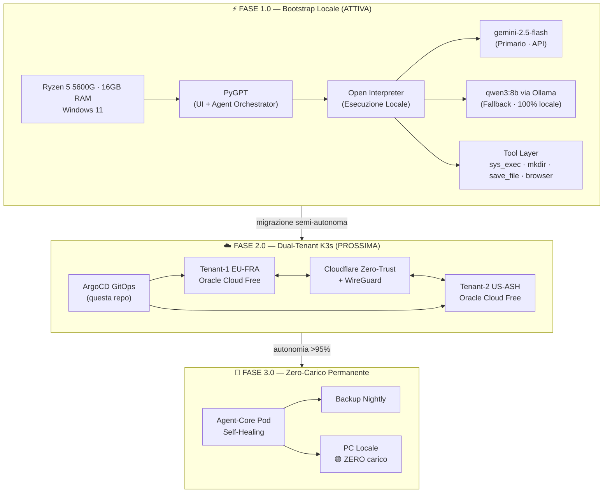

# 🤖 DUST AI – Architettura Universale Cloud Agentica (Zero-Cost) 2026

> **ASE 1.0** · Bootstrap Locale · Ryzen 5 5600G + 16 GB RAM · Windows 11  
> Gemini 2.5 Flash/Pro · Perplexity Sonar · Ollama locale · PyGPT + Open Interpreter

---

## 📐 Architettura – Visione End-to-End



---

## 📁 Struttura Repository

```
dustai/
├── README.md                  # Questo file
├── .gitignore                 # Windows + Python
├── config/
│   ├── models.json            # PyGPT – modelli ottimizzati (Gemini + Perplexity)
│   ├── profile.json           # PyGPT – profilo Windows ottimizzato
│   └── open_interpreter.yaml  # Configurazione Open Interpreter
├── agents/
│   ├── agent_system_prompt.md # Prompt di sistema principale per Agent mode
│   ├── agent_fast.md          # Prompt per task veloci (Flash)
│   └── agent_research.md      # Prompt per ricerca (Perplexity Sonar)
├── prompts/
│   ├── file_ops.md            # Prompt ottimizzati per operazioni file Windows
│   ├── code_gen.md            # Prompt per generazione codice
│   └── computer_use.md        # Prompt per Computer Use (gemini-2.5-computer-use)
├── docs/
│   ├── fase1.md               # Roadmap e stato Fase 1.0
│   ├── fase2.md               # Piano migrazione K3s
│   └── troubleshooting.md     # Fix problemi noti (OneDrive Desktop, 429, ecc.)
└── logs/                      # Log sessioni agent (gitignored)
```

---

## ⚙️ Stack Tecnologico

| Layer | Tecnologia | Costo |
|---|---|---|
| UI + Orchestrazione | PyGPT 2.7.12 | €0 |
| Modello primario | gemini-2.5-flash (API Google) | €0 free tier |
| Modello pesante | gemini-2.5-pro (pay-as-you-go) | ~€0.001/query |
| Ricerca web | Perplexity Sonar Pro | key esistente |
| Modello locale | qwen3:8b via Ollama | €0 |
| Fallback locale | mistral-small3.1 via Ollama | €0 |
| Esecuzione locale | Open Interpreter | €0 |
| Computer Use | gemini-2.5-computer-use-preview | €0 preview |

---

## 🚀 Quick Start

### 1. Clona la repo
```bash
git clone https://github.com/Tenkulo/dustai.git
cd dustai
```

### 2. Installa dipendenze
```bash
pip install open-interpreter
# Ollama: https://ollama.ai
ollama pull qwen3:8b
ollama pull mistral-small3.1:latest
```

### 3. Configura PyGPT
- Copia `config/models.json` in `%APPDATA%\pygpt-net\`
- Copia `config/profile.json` in `%APPDATA%\pygpt-net\`
- Imposta le API key in PyGPT → Settings → API Keys:
  - `api_key_google` = la tua Gemini API key
  - `api_key_perplexity` = la tua Perplexity API key

### 4. Configura Open Interpreter
```bash
interpreter --config  # segui il wizard
# oppure copia config/open_interpreter.yaml
```

### 5. Verifica il percorso Desktop (Windows + OneDrive)
In PyGPT Agent mode, esegui:
```
Esegui con sys_exec: cmd /c echo %OneDrive%\Desktop
```

---

## 📊 Stato Fasi

| Fase | Stato | Autonomia |
|---|---|---|
| 1.0 Bootstrap Locale | 🟡 In corso | ~88% |
| 1.1 iGPU + qwen3:8b | ⬜ Pianificata | ~93% target |
| 2.0 Dual-Tenant K3s | ⬜ Pianificata | ~96% target |
| 3.0 Zero-Carico | ⬜ Futura | >95% target |

---

## 🐛 Problemi Noti e Fix

Vedi [`docs/troubleshooting.md`](docs/troubleshooting.md) per soluzioni a:
- 429 RESOURCE_EXHAUSTED Gemini (free tier limit)
- `sys_exec` vs `mkdir`/`save_file` su Windows
- Desktop non trovato (OneDrive path redirect)
- `tool_calls: false` su modelli Gemini

---

## 📜 Licenza

MIT – Libero uso personale e commerciale.
